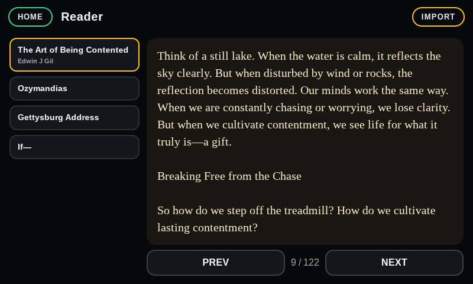
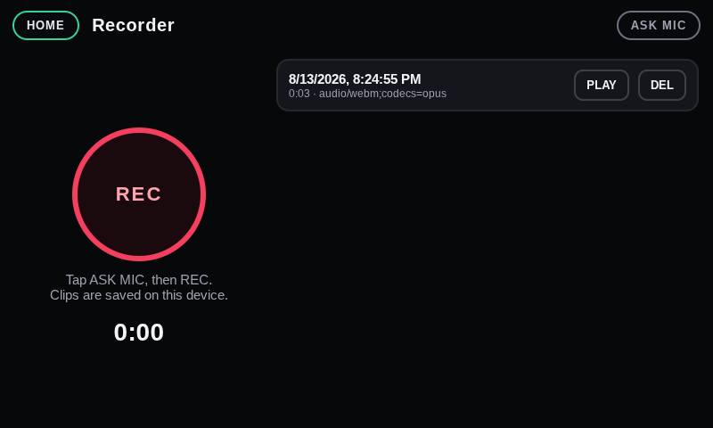

# 🏎️ Spotify Car Thing — Nocturne OS & Custom Apps Toolkit

[](https://github.com/)
[](https://github.com/)
[](https://github.com/)
[](LICENSE)

An end-to-end custom operating environment and application suite for the **Spotify Car Thing** (Amlogic S905D2 / Superbird). 

When Spotify discontinued the Car Thing in late 2024 and scheduled the bricking of all active devices, this project was engineered to repurpose the hardware into a standalone, offline handheld and desk companion: a rotary-dial game console, offline e-reader, microphone voice memo recorder, ambient night lamp, and even an x86 virtual PC running KolibriOS.

---

## 📸 Screenshots (Captured Directly on Real Hardware)

### 🎮 Custom Rotary Dial & Coverflow Launcher
The custom Chromium kiosk shell runs native 800×480 with GPU hardware acceleration. The rotary dial scrolls through a 3D animated card deck with a 70ms hardware debounce lock.

<p align="center">
  
  
</p>

---

### 📖 Dial-Controlled E-Reader & 🎙️ Voice Memo Recorder
- **E-Reader:** Uses the physical rotary dial to flip book pages. Reconstructs reflowable EPUBs into clean paginated views.
- **Voice Recorder:** Taps directly into the Car Thing’s onboard microphone array to record voice notes saved locally to flash storage.

<p align="center">
  
  
</p>

---

### 🖥️ KolibriOS x86 PC Emulation & 📝 Touch Notes
- **KolibriOS:** Boots a real 32-bit x86 operating system in a 32MB virtual machine (`libv86.js` + `v86.wasm`) with a custom smooth touch trackpad, Start Menu button, and on-screen keyboard.
- **Notes:** Full on-screen touch keyboard designed for the 800×480 screen with persistent IndexedDB storage.

<p align="center">
  
  
</p>

---

## 🔍 How Everything Was Engineered (Honest Technical Breakdown)

### 1. The Bootloader & Driver Handshake Layer
The Car Thing's Amlogic bootloader is notoriously finicky on Windows. 
- **`install-driver.ps1`:** Automatically matches the USB vendor/device ID (`1B8E:C003`, "WorldCup Device") and silently deploys the custom WinUSB/libusb driver via `CTDrvInst.exe`.
- **`retry-handshake.ps1`:** Implements an automated polling loop with `superbird_tool.py` that watches for device attachment and safely triggers `--burn_mode`, shifting the device from standard USB enumeration into USB Burn Mode without manual timing guesswork.

### 2. The Linux OS & Display Pipeline
The device runs **Nocturne Linux** (`7.0.2-superbird #1 SMP PREEMPT aarch64`):
- **Compositor:** Weston Wayland compositor (`weston --config=/etc/weston.ini --socket=wayland-1`).
- **Kiosk Engine:** A specialized build of Chromium's `cast_shell` (`chromium-bin`) running directly on Wayland with OpenGL ES acceleration (`--use-angle=gles --ozone-platform=wayland`).
- **Storage Architecture:** The root filesystem (`/dev/root`) is mounted read-only for power-loss resilience, while user web applications, tools, and games reside on the writable `/opt/nocturne` partition (`/dev/mmcblk0p6`).

### 3. Hardware Control Mapping
The launcher (`launcher/index.html`) hooks directly into the physical hardware events:
- **Rotary Encoder Wheel:** Handled with an accumulator and a 70ms debounce window (`window.addEventListener("wheel", ...)`) so turning the dial scrolls cards smoothly without jumping.
- **Dial Push Button:** Dispatches `Enter` / `MediaPlayPause` to launch the focused card.
- **Hardware Preset Buttons:** Top buttons (`1`–`4` / `m`) cycle between the **GAMES**, **TOOLS**, and **APPS** tabs.

### 4. Game Optimization (Case Study: Among Us)
Many web game bundles ship as single-file HTML files containing giant base64-encoded zip files. In the original `amongus.html`:
- A 7.35MB zip was base64-decoded in pure JavaScript on every launch.
- `JSZip` ran in-memory decompression, allocating over 150MB of RAM and taking **15–20 seconds** to load.
- Web Audio threads repeatedly stalled because the kiosk runs with audio output disabled.

**What we did:**
1. **Unbundled Disk Assets:** Extracted all 42 textures, scripts (`data.json`, `redblackset.js`, `pathfind.js`), and sprites directly onto the device's eMMC storage.
2. **File Size Slashed:** Reduced the HTML file from **7.9 MB down to ~430 KB** (a **95% reduction**).
3. **Instant Startup:** Load times dropped from **20 seconds to under 1 second**.
4. **GPU Optimization:** Forced `window.devicePixelRatio = 1.0` and disabled WebGL multisample antialiasing for maximum fillrate on the Mali GPU.

### 5. Fixing the Microphone Hardware (`recorder.html`)
The background Nocturne wake-word daemon (`nocturned`) holds exclusive lock on ALSA device `hw:0,0`. As a result, standard `getUserMedia` browser calls failed with `EBUSY (Device or resource busy)`.
- Discovered that the second capture link (`hw:0,1` on the Superbird sound card) was completely unreserved.
- Created `/etc/asound.conf` to route default ALSA capture through `plughw:0,1` with automatic resampling. The browser now records clean audio memos to IndexedDB without interfering with the system daemon.

### 6. KolibriOS: Touch Trackpad & On-Screen Keyboard
Because KolibriOS runs with a standard PS/2 mouse driver, absolute touch coordinates were ignored by the virtual machine:
- Implemented **relative touch drag (`touchmove`)** translating finger gestures into smooth PS/2 `mouse-delta` packets like a laptop trackpad.
- Added a **dedicated `MENU` button** in the HUD that injects the native Windows key scancode (`0xE05B`), opening the KolibriOS Start Menu in 1 tap.
- Added a **slide-up 5-row virtual keyboard** sending simulated scancodes into the x86 keyboard controller.

---

## 🗂️ Included Web Applications

### 🎮 Games (23 Handheld & Dial Games)
- **Among Us** (Optimized direct disk runtime + virtual HUD)
- **Retro Bowl** (Football)
- **Crossy Road**
- **Fruit Ninja** (Touch swiping)
- **Tiny Fishing**
- **Paper.io 2**
- **Draw Climber**
- **Helix Jump**
- **Stacktris** & **Stack**
- **Noob Miner** (With virtual D-Pad + hotbar controls)
- **Wheelie Bike**
- **2048** (Rotary dial & swipe controls)
- **Chrome Dino**
- **Trap the Cat**
- **Sand Game** (Physics sandbox)
- **Wordle Unlimited**
- **Doodle Jump**
- **Minesweeper**
- **Spacebar Clicker**
- **Opposite Day**
- **Age of War**

### 🛠️ Tools Suite
- 🎙️ **Recorder:** Mic memo recorder saving directly to device storage.
- 📖 **Reader:** Turn pages using the dial wheel.
- 📝 **Notes:** Touch notepad with full virtual QWERTY keyboard.
- ⏰ **Clock:** Real-time clock, stopwatch, and countdown timer.
- 🧮 **Calculator:** Touch-friendly calculation pad.
- 💡 **Lamp:** Ambient light with White, Night-Vision Red, and Dim modes.

---

## 💻 Desktop Companion App (`carthing_apps.py`)

A desktop companion GUI built with Python and Tkinter:
- **Auto USB Detection:** Monitors the USB RNDIS interface (`10.42.1.242`) with a live status LED indicator.
- **App Manager:** Drag-and-drop any self-contained HTML file or folder onto the Car Thing.
- **Touch Pad Injection:** Check one box (`WASD pad on new HTML`) to automatically inject the floating analog stick and action buttons into any game.
- **One-Click Sync:** Automatically uploads new assets over SCP, updates the catalog, and restarts the kiosk.
- **Silent Launch:** Includes a `Car Thing Apps.lnk` Windows shortcut configured with `pythonw.exe` to launch without a black console window.

---

## ⚡ 1-Click Complete Installer

Getting everything onto your Car Thing takes just **one double-click**:

1. Plug your Car Thing into your PC via USB.
2. Double-click **`1-Click-Install.bat`** (or run `python install.py`).

The automated installer will:
- [x] Detect your Car Thing on the USB network (`10.42.1.242`).
- [x] Deploy the 3D coverflow launcher, catalog, and touchscreen fixing scripts.
- [x] Deploy all **23 games** (including optimized Among Us) and the **Tools suite** (Reader, Voice Recorder, Notes, Clock, Lamp).
- [x] Deploy **KolibriOS x86 PC emulation** with the touch trackpad and on-screen keyboard.
- [x] Configure ALSA dual-link microphone capture in `/etc/asound.conf`.
- [x] Create a **`Car Thing Apps`** shortcut on your Windows Desktop.
- [x] Restart the kiosk on the device so it immediately lights up with your new system!

---

## 🚀 Quick Start & Manual Guide

### Requirements
- A Spotify Car Thing (flashed with Nocturne image v4.x).
- Windows PC with Python 3.10+ (installer will auto-install Python if missing).
- USB-C data cable connected to the PC.

### Installation
1. Clone this repository:
   ```bash
   git clone https://github.com/Gilzone/carthing-apps.git
   cd carthing-apps
   ```
2. Double-click `1-Click-Install.bat`
3. Launch the desktop manager anytime from your Desktop or via:
   ```bash
   python carthing_apps.py
   ```
   *(Or double click `Car Thing Apps.bat`)*

### Command Line Usage (`add_project.py`)
```bash
# Add a single HTML app to the Apps tab
python add_project.py "C:\path\to\app.html" --name "Weather" --hint "Local forecast"

# Add an app with the virtual touch pad injected and deploy immediately
python add_project.py "C:\path\to\game.html" --pad --deploy

# List all installed apps
python add_project.py --list
```

---

## 📜 License
This project is open-source under the **MIT License**. Created with passion for keeping discontinued hardware alive and out of landfills.
