# 🏎️ Spotify Car Thing — Nocturne OS & Custom Apps Toolkit

[](https://github.com/)
[](https://github.com/)
[](https://github.com/)
[](https://github.com/)
[](https://github.com/)
[](https://github.com/)
[](LICENSE)

An end-to-end custom operating environment and application suite for the **Spotify Car Thing** (Amlogic S905D2 / Superbird). 

When Spotify discontinued the Car Thing in late 2024 and scheduled the bricking of all active devices, this project was engineered to repurpose the hardware into a standalone, offline handheld and desk companion: a rotary-dial game console, offline e-reader, microphone voice memo recorder, ambient night lamp, and even an x86 virtual PC running KolibriOS.

> [!IMPORTANT]
> ### 🔌 100% On-Device Execution — No PC, Server, or Internet Required!
> Unlike many other Car Thing projects that require a host PC or server streaming content in the background, **every app, game, tool, and emulator in this repository runs 100% locally on the Car Thing hardware itself**:
> - **No Host PC Running in the Background:** Once installed via the 1-Click Installer, you can unplug the Car Thing from your computer and power it from any standard USB port, car charger, or power bank.
> - **Zero Servers or Cloud APIs:** All 23 games, tools, audio recordings, and the KolibriOS x86 virtual machine execute directly on the Car Thing's internal quad-core Amlogic processor and eMMC storage.
> - **100% Offline:** Fully operational with zero internet or Wi-Fi connection. Take it on road trips, off-grid, or keep it on your desk as an independent gadget.

---

## 📸 Screenshots (Captured Directly on Real Hardware)

### 🎮 Custom Rotary Dial & Coverflow Launcher
The custom Chromium kiosk shell runs native 800×480 with GPU hardware acceleration. The rotary dial scrolls through a 3D animated card deck with a 70ms hardware debounce lock.

<p align="center">
  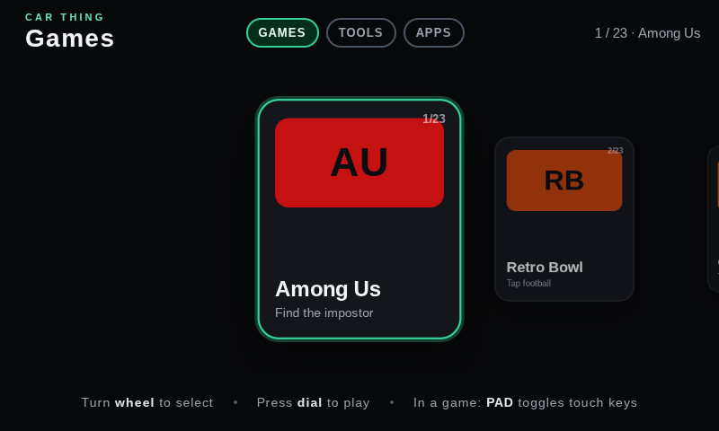
  
  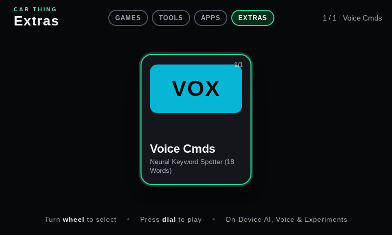
</p>


---

### 🕹️ Dedicated Game Boy (GB) Player (Tools Tab)
- **Authentic DMG Emulation:** Built with the high-performance, cycle-accurate `GameBoyCore` engine. Zero input latency, locked at 60 FPS, with authentic monochrome/green tint palettes.
- **Hardware-Integrated Controls:**
  - **🔘 Knob Push (Click Dial):** Triggers **Button A** (Jump, Attack, Confirm) with a green HUD status badge.
  - **🔴 Dedicated Thumb Button:** Large 82px Coral Red **Button B** (Cancel, Run, Inhale) comfortably positioned for your right thumb.
  - **Physical Back Button:** Also wired directly to **Button B**.
  - **Tactile D-Pad & Top Buttons:** Full capacitive 4-way cross pad on the left, with Top Button `2` for **SELECT** and Top Button `3` for **START**.
- **Pre-Loaded Classics:**
  - 🗡️ **The Legend of Zelda: Link's Awakening:** Classic top-down dungeon crawler and island adventure.
  - ⭐ **Kirby's Dream Land 2:** Iconic platforming with Rick, Kine, and Coo.
  - 🔴 **Pokémon Red Version:** The definitive original monster-catching RPG.
  - ➕ **Custom ROMs:** Tap `📂 ROM` to load any `.gb` or `.gbc` file directly from device storage.

<p align="center">
  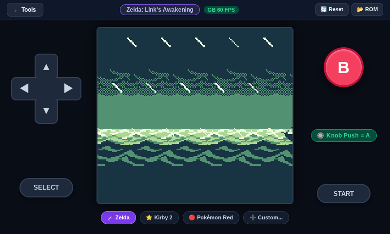
  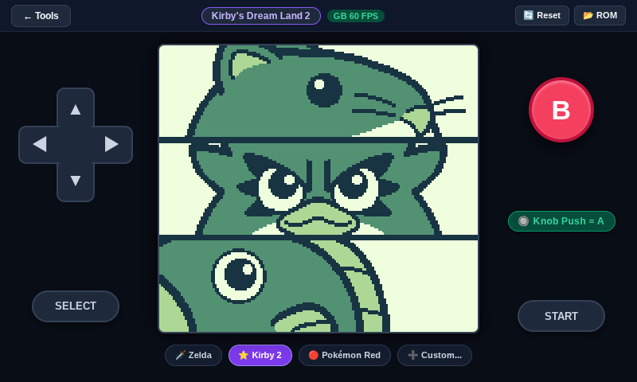
  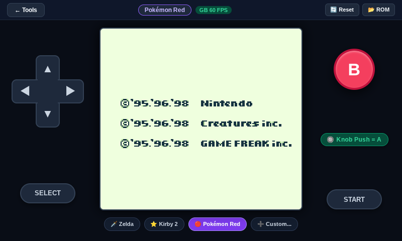
</p>

### 🔤 Morse Learn - Google Creative Lab Edition (Tools Tab)
- **Visual Mnemonic Trainer:** Re-engineered specifically for the Car Thing's 800×480 display, featuring all 26 visual mnemonic cards from Google Creative Lab (*Archery, Banjo, Candy, Dog, etc.*).
- **Physical Knob & Hardware Controls:**
  - **🔘 Push Knob (Click Dial):** Types **DOT (`•`)**
  - **Physical Back Button:** Types **DASH (`━`)**
  - **🔄 Turn Knob:** Cycles through letters A–Z and words
  - **Top Preset Buttons 1 & 2:** Also act as physical Dot and Dash keys
- **3 Practice Modes:**
  - **LEARN A-Z:** Interactive alphabet trainer with visual dot/dash lights and instant audio feedback.
  - **WORDS:** Morse spelling practice using real vocabulary words.
  - **TELEGRAPH DECODER:** Freeform telegraph mode decoding any tapped dots and dashes into English in real-time.
- **Synthesized Audio:** Web Audio 750Hz Morse sidetone beeps for authentic auditory reinforcement.

<p align="center">
  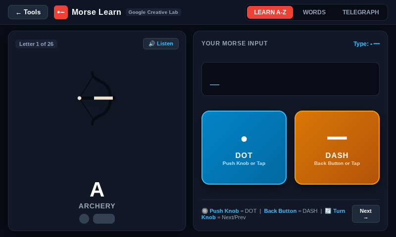
  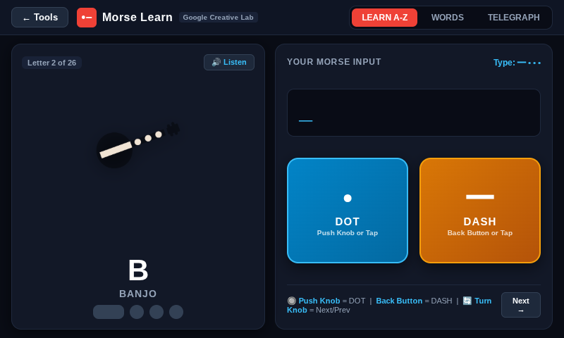
</p>

### 🏎️ Automotive HUD Clock & 🚗 Car Unit Converter (Tools Tab)
- **HUD Dashboard Clock:** High-contrast digital clock with Cyber, Amber, and Night Vision Red HUD themes designed for automotive dashboard use. Fully integrated with physical controls: push the knob to start/stop the precision stopwatch and countdown timer; turn the knob to adjust minutes; press the physical Back button to reset.
- **Car Unit Converter & Calculator:** Instant live conversions for automotive metrics: speed ($km/h \leftrightarrow mph$), tire pressure ($PSI \leftrightarrow Bar$), temperature ($^\circ C \leftrightarrow ^\circ F$), and fuel consumption ($MPG \leftrightarrow L/100km$).
- **Game Boy Battery Auto-Save:** Cycle-accurate cartridge battery SRAM saves (Zelda, Pokémon Red, Kirby) auto-saved to persistent local storage every 12 seconds and restored on boot with dedicated `[ 💾 Save ]` controls.

<p align="center">
  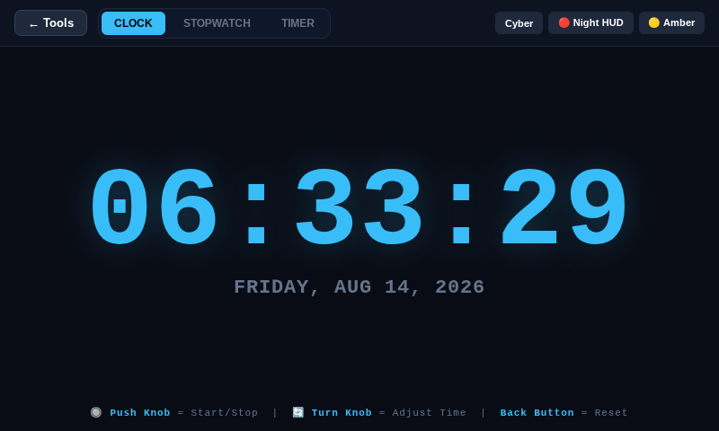
  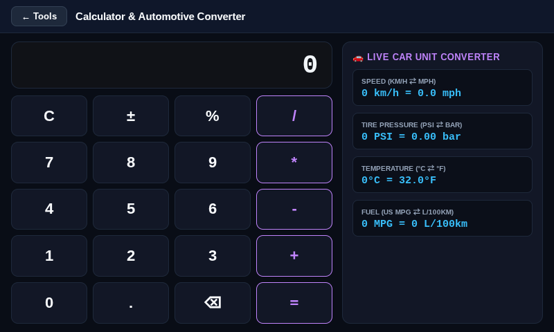
</p>

---

### 📖 Dial-Controlled E-Reader, 🎙️ Voice Memo Recorder & 📡 Optical Transfer (Decimen)
- **E-Reader:** Uses the physical rotary dial to flip book pages. Reconstructs reflowable EPUBs into clean paginated views.
- **Voice Recorder:** Taps directly into the Car Thing’s onboard microphone array to record voice notes saved locally to flash storage.
- **Optical Transfer (Decimen Beam):** Air-gapped wireless file transfer that beams audio recordings, notes, and text directly from the Car Thing's screen to any smartphone camera via [decimen.app](https://decimen.app/) using Luby Transform (LT) fountain codes. No cables, no Wi-Fi, and no Bluetooth pairing needed!
- **Camera-Balanced Optical Density:** Custom-tuned for the Car Thing's 800×480 display (250 bytes/frame, 12 FPS, 0.74 viewport budget) to eliminate dense micro-dots and generate chunky, high-contrast QR modules (~7px) that any smartphone camera locks onto in milliseconds.
- **Deep System Integration:** One-tap `BEAM 📡` button next to every memo in the Recorder app, direct IndexedDB clip picker, and standalone launcher card.

<p align="center">
  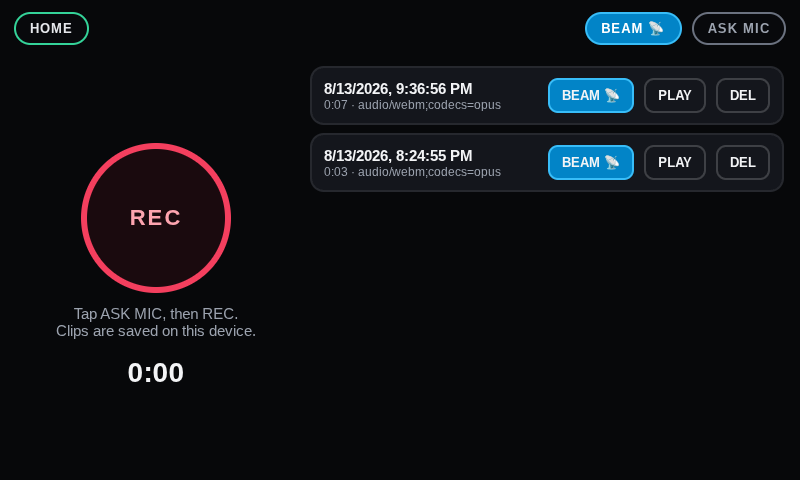
  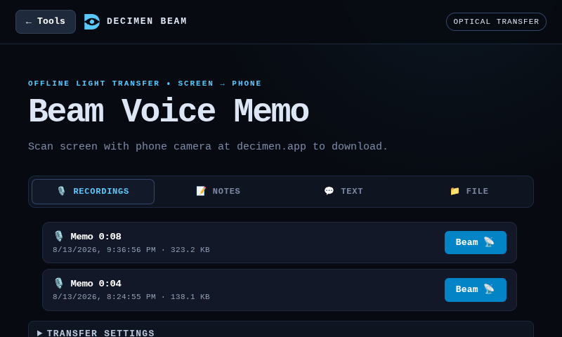
</p>
<p align="center">
  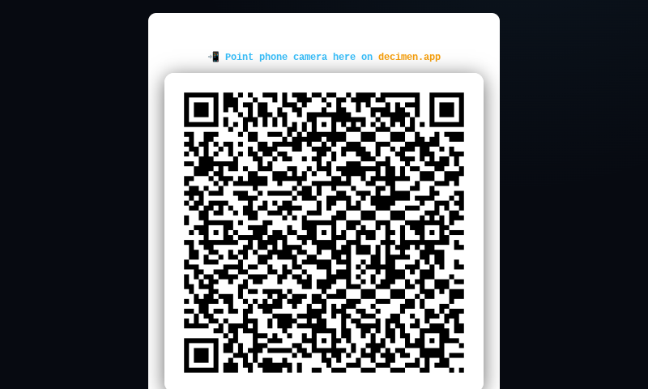
  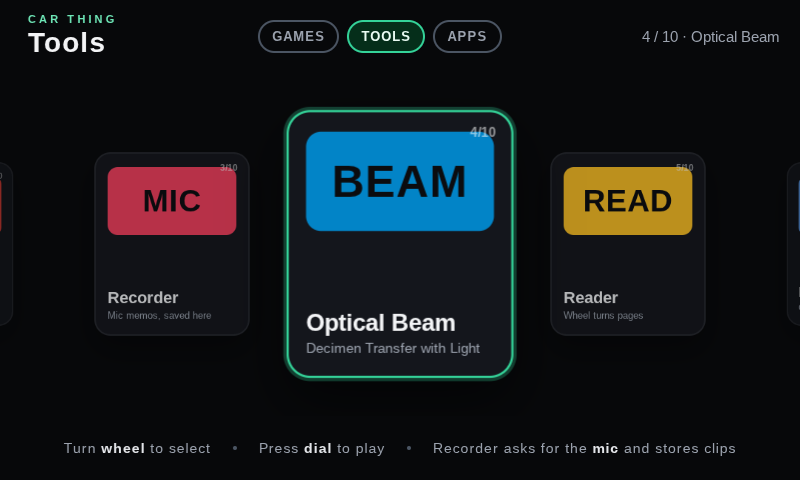
</p>

---

### 🖥️ KolibriOS x86 PC Emulation & 📝 Touch Notes
- **KolibriOS:** Boots a real 32-bit x86 operating system in a 32MB virtual machine (`libv86.js` + `v86.wasm`) with a custom smooth touch trackpad, Start Menu button, and on-screen keyboard.
- **Notes:** Full on-screen touch keyboard designed for the 800×480 screen with persistent IndexedDB storage.

<p align="center">
  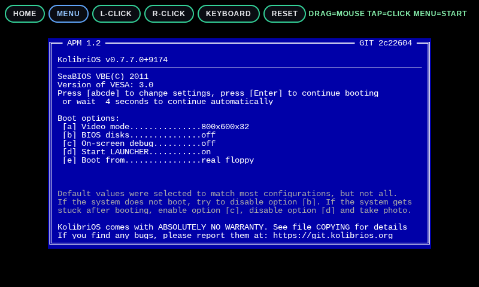
  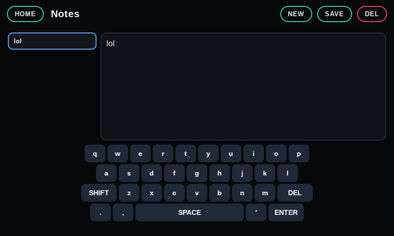
</p>

---

### 🌐 100% Offline On-Device Neural Translator (Marian NMT / Bergamot WASM)
- **Edge AI on ARM:** Translates full sentences on-device using quantized Marian NMT neural networks compiled to WebAssembly. Zero companion PC, zero cloud APIs, zero internet.
- **Instant Touch Typing & Debounce Guard:** Includes an on-screen capacitive keyboard with high-precision hardware debounce preventing double-tap glitches, uppercase/lowercase/number modes, and Spanish characters (`ñ`, `¿`, `¡`).
- **Instant Bidirectional Swapping:** Tapping `[ ⇄ Swap ]` flips between English $\rightarrow$ Spanish and Spanish $\rightarrow$ English, automatically copying the translated text into the input field for instant reverse conversation.

<p align="center">
  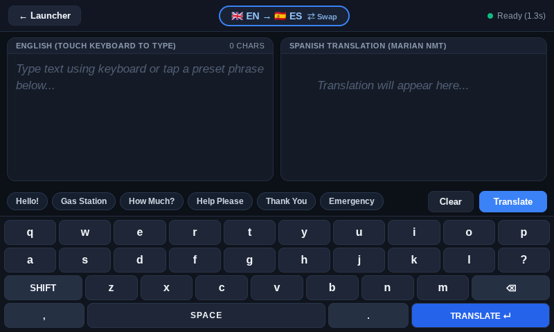
  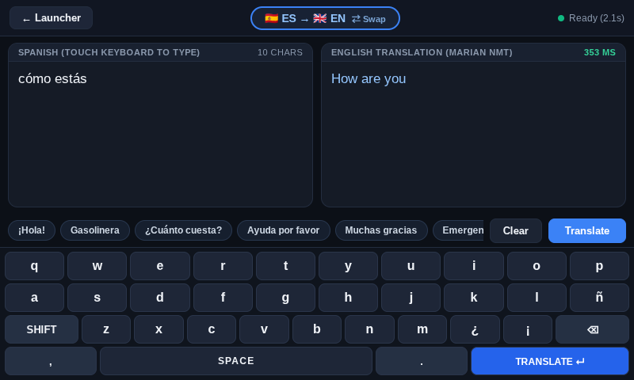
</p>

---

### ⚡ Voice Commands & Keyword Spotting (KWS) (Extras Tab)
- **100% On-Device Neural Audio:** Powered by TensorFlow.js and Google's Speech Commands model running hardware-accelerated on the Mali-G31 GPU shaders.
- **Instant Speech Recognition:** Recognizes 18 distinct voice commands in real time with ~50ms latency:
  - **Confirmations:** `YES`, `NO`
  - **Actions:** `GO`, `STOP`
  - **Directions:** `UP`, `DOWN`, `LEFT`, `RIGHT`
  - **Digits:** `ZERO` through `NINE`
- **Zero Internet / Zero Server:** All neural weights and model architectures (~7 MB) are stored directly on the Car Thing's internal flash storage.
- **Hardware Dial Push:** Click the physical rotary dial to toggle the microphone on or off with instant visual HUD feedback.

<p align="center">
  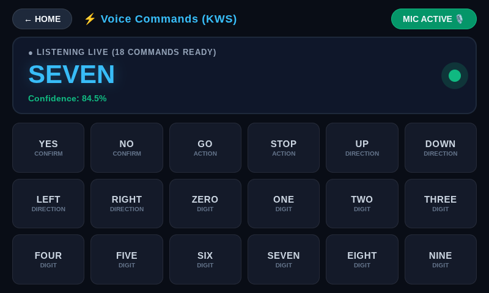
</p>


---

## 🔍 How Everything Was Engineered (Honest Technical Breakdown)

### 1. The Bootloader & Driver Handshake Layer
The Car Thing's Amlogic bootloader is notoriously finicky on Windows. 
- **`install-driver.ps1`:** Automatically matches the USB vendor/device ID (`1B8E:C003`, "WorldCup Device") and silently deploys the custom WinUSB/libusb driver via `CTDrvInst.exe`.
- **`retry-handshake.ps1`:** Implements an automated polling loop with `superbird_tool.py` that watches for device attachment and safely triggers `--burn_mode`, shifting the device from standard USB enumeration into USB Burn Mode without manual timing guesswork.

### 2. The Linux OS & Display Pipeline
The device runs **Nocturne Linux** (`7.0.2-superbird #1 SMP PREEMPT aarch64`):
- **Compositor:** Weston Wayland compositor (`weston --config=/etc/weston.ini --socket=wayland-1`).
- **Kiosk Engine:** A specialized build of Chromium's `cast_shell` (`chromium-bin`) running directly on Wayland with OpenGL ES acceleration (`--use-angle=gles --ozone-platform=wayland`).
- **Storage Architecture:** The root filesystem (`/dev/root`) is mounted read-only for power-loss resilience, while user web applications, tools, and games reside on the writable `/opt/nocturne` partition (`/dev/mmcblk0p6`).

### 3. Hardware Control Mapping
The launcher (`launcher/index.html`) hooks directly into the physical hardware events:
- **Rotary Encoder Wheel:** Handled with an accumulator and a 70ms debounce window (`window.addEventListener("wheel", ...)`) so turning the dial scrolls cards smoothly without jumping.
- **Dial Push Button:** Dispatches `Enter` / `MediaPlayPause` to launch the focused card.
- **Hardware Preset Buttons:** Top buttons (`1`–`4` / `m`) cycle between the **GAMES**, **TOOLS**, and **APPS** tabs.

### 4. Game Optimization (Case Study: Among Us)
Many web game bundles ship as single-file HTML files containing giant base64-encoded zip files. In the original `amongus.html`:
- A 7.35MB zip was base64-decoded in pure JavaScript on every launch.
- `JSZip` ran in-memory decompression, allocating over 150MB of RAM and taking **15–20 seconds** to load.
- Web Audio threads repeatedly stalled because the kiosk runs with audio output disabled.

**What we did:**
1. **Unbundled Disk Assets:** Extracted all 42 textures, scripts (`data.json`, `redblackset.js`, `pathfind.js`), and sprites directly onto the device's eMMC storage.
2. **File Size Slashed:** Reduced the HTML file from **7.9 MB down to ~430 KB** (a **95% reduction**).
3. **Instant Startup:** Load times dropped from **20 seconds to under 1 second**.
4. **GPU Optimization:** Forced `window.devicePixelRatio = 1.0` and disabled WebGL multisample antialiasing for maximum fillrate on the Mali GPU.

### 5. Fixing the Microphone Hardware (`recorder.html`)
The background Nocturne wake-word daemon (`nocturned`) holds exclusive lock on ALSA device `hw:0,0`. As a result, standard `getUserMedia` browser calls failed with `EBUSY (Device or resource busy)`.
- Discovered that the second capture link (`hw:0,1` on the Superbird sound card) was completely unreserved.
- Created `/etc/asound.conf` to route default ALSA capture through `plughw:0,1` with automatic resampling. The browser now records clean audio memos to IndexedDB without interfering with the system daemon.

### 6. KolibriOS: Touch Trackpad & On-Screen Keyboard
Because KolibriOS runs with a standard PS/2 mouse driver, absolute touch coordinates were ignored by the virtual machine:
- Implemented **relative touch drag (`touchmove`)** translating finger gestures into smooth PS/2 `mouse-delta` packets like a laptop trackpad.
- Added a **dedicated `MENU` button** in the HUD that injects the native Windows key scancode (`0xE05B`), opening the KolibriOS Start Menu in 1 tap.
- Added a **slide-up 5-row virtual keyboard** sending simulated scancodes into the x86 keyboard controller.

### 7. 100% Offline On-Device Neural Translator (Mozilla Bergamot / Marian NMT)
<p align="center">
  
</p>

Bringing true edge-AI Machine Translation to the Spotify Car Thing without internet connectivity or a companion PC:
- **Neural Engine:** Powered by **Mozilla Project Bergamot** (Marian NMT) compiled to single-threaded WebAssembly with fallback 8-bit quantized GEMM matrix routines (`int8shiftAll`).
- **Direct-Disk Zero-Overhead Loading:** Shrunk the webapp from an unwieldy 43MB base64 bundle down to **106 KB** (a **99.7% reduction**). Model binaries (`model.*.bin`), shortlist lexicons, and SentencePiece vocabularies are stored directly on the internal eMMC flash storage and loaded asynchronously via local `XMLHttpRequest` (`arraybuffer`) in <0.2 seconds.
- **Smart RAM Deallocation:** Running two 17MB neural models concurrently would exhaust the Car Thing's ~450MB physical RAM and cause swap thrashing. By calling Marian's explicit C++ destructor (`activeModel.delete()`) prior to direction swaps, memory is instantly reclaimed, keeping total RAM consumption under **~35MB** with **>250MB free RAM**.
- **Hardware-Debounced Touch Keyboard:** Embedded capacitive screens fire both `pointerdown` and `touchstart` events within 2ms of a finger touch, which causes standard web inputs to double-type characters (`"ee"`). Implemented a high-precision hardware debounce filter (`performance.now()`) with cursor-aware selection tracking, uppercase/lowercase/numbers switching, and Spanish-specific characters (`ñ`, `¿`, `¡`).
- **Automatic Sentence Case Normalization:** Marian NMT tokenizers require natural casing to avoid verbatim fallback. Built-in normalization seamlessly formats all-caps or lowercase input into clean sentence case before inference.
- **Automotive Travel UI:** Pre-loaded with one-touch travel & emergency phrase pills (gas station, hospital, help, directions) and 1-tap bidirectional swap (`[ ⇄ Swap ]`) that auto-populates translated responses for fluid conversation.

---

## 🗂️ Included Web Applications

### 🎮 Games (23 Handheld & Dial Games)
- **Among Us** (Optimized direct disk runtime + virtual HUD)
- **Retro Bowl** (Football)
- **Crossy Road**
- **Fruit Ninja** (Touch swiping)
- **Tiny Fishing**
- **Paper.io 2**
- **Draw Climber**
- **Helix Jump**
- **Stacktris** & **Stack**
- **Noob Miner** (With virtual D-Pad + hotbar controls)
- **Wheelie Bike**
- **2048** (Rotary dial & swipe controls)
- **Chrome Dino**
- **Trap the Cat**
- **Sand Game** (Physics sandbox)
- **Wordle Unlimited**
- **Doodle Jump**
- **Minesweeper**
- **Spacebar Clicker**
- **Opposite Day**
- **Age of War**

### 🛠️ Complete Tools & Applications Suite
- 📡 **Optical Beam (Decimen):** 100% offline file and voice memo transfer using screen light and smartphone camera at [decimen.app](https://decimen.app/). Zero cables, zero Wi-Fi, zero Bluetooth pairing.
- 🎙️ **Voice Memo Recorder:** Direct on-device microphone memo recording with real-time bouncing VU soundwave visualizer, rotary dial push-to-record, hardware debounce, and direct `BEAM 📡` integration.
- 🕹️ **Morse Learn (Google Creative Lab Edition):** Full visual mnemonic Morse code trainer with Web Audio sidetones, rotary dial DOT/DASH telegraph input, and Words training.
- 🏎️ **Automotive HUD Clock & Car Unit Converter:** High-contrast Cyber/Amber/Night-Vision Red HUD clock, precision stopwatch, and automotive conversions ($km/h \leftrightarrow mph$, $PSI \leftrightarrow Bar$, $^\circ C \leftrightarrow ^\circ F$, $MPG \leftrightarrow L/100km$).
- 🎮 **Game Boy & GBA Retro Player:** High-performance `binjgb` WebAssembly Game Boy Color engine with cycle-accurate 60 FPS video/audio, battery SRAM auto-saving, and preloaded homebrew games (`Celeste Classic`, `Advancetris`, `Anguna`).
- 🌐 **Offline Neural Translator:** 100% on-device bidirectional Neural Machine Translation (English ↔ Spanish) powered by Mozilla Bergamot / Marian NMT WASM and bundled neural models.
- 📖 **E-Reader:** Paginated reflowable book reader with physical rotary dial page turning.
- 🖥️ **KolibriOS x86 PC:** Real 32-bit x86 desktop operating system running in a virtual machine with custom touch trackpad and on-screen keyboard.
- 📝 **Notes:** Persistent touch notepad with full debounced on-screen keyboard.
- 💡 **Lamp:** Multi-mode ambient light with White, Amber, and Night-Vision Red modes.
- 🧮 **Calculator:** Automotive and general touch calculation pad.

---

## 💻 Desktop Companion App (`carthing_apps.py`)

A desktop companion GUI built with Python and Tkinter:
- **Auto USB Detection:** Monitors the USB RNDIS interface (`10.42.1.242`) with a live status LED indicator.
- **App Manager:** Drag-and-drop any self-contained HTML file or folder onto the Car Thing.
- **Touch Pad Injection:** Check one box (`WASD pad on new HTML`) to automatically inject the floating analog stick and action buttons into any game.
- **One-Click Sync:** Automatically uploads new assets over SCP, updates the catalog, and restarts the kiosk.
- **Silent Launch:** Includes a `Car Thing Apps.lnk` Windows shortcut configured with `pythonw.exe` to launch without a black console window.

---

## ⚡ 1-Click Complete Installer

Getting everything onto your Car Thing takes just **one double-click**:

1. Plug your Car Thing into your PC via USB.
2. Double-click **`1-Click-Install.bat`** (or run `python install.py`).

The automated installer will:
- [x] Detect your Car Thing on the USB network (`10.42.1.242`).
- [x] Deploy the 3D coverflow launcher, catalog, and touchscreen fixing scripts.
- [x] Deploy all **23 games** (including optimized Among Us and retro homebrew) and the **complete Tools suite** (Optical Beam, Voice Recorder, Morse Learn, HUD Clock, Translator, Reader, Notes, KolibriOS).
- [x] Deploy all **WebAssembly engines and offline neural models** (`binjgb.wasm`, `bergamot-translator-worker.wasm`, translation models).
- [x] Configure ALSA dual-link microphone capture in `/etc/asound.conf`.
- [x] Create a **`Car Thing Apps`** shortcut on your Windows Desktop.
- [x] Restart the kiosk on the device so it immediately lights up with your new system!

---

## 🛠️ Complete Setup Guide (From Scratch to Gaming)

### Scenario A: Your Car Thing Already Has Nocturne Linux
If your Car Thing already boots into Nocturne OS:
1. Clone this repo:
   ```bash
   git clone https://github.com/Gilzone/carthing-apps.git
   cd carthing-apps
   ```
2. Double-click **`1-Click-Install.bat`**. You're done!

---

### Scenario B: Starting from a Stock or Bricked Car Thing
Everything needed to revive a stock or bricked device is provided directly in this repository and our official release:

1. **Download the Nocturne OS Image:**
   - Download **[`nocturne_image_v4.1.3.zip`](https://github.com/Gilzone/carthing-apps/releases/tag/v1.0.0)** directly from the **[Releases](https://github.com/Gilzone/carthing-apps/releases/tag/v1.0.0)** page.
2. **Install Bootloader Driver (Windows):**
   - Run `tools/flashing/install-driver.ps1` (or use Zadig) to install the WinUSB driver for Amlogic device `1B8E:C003`.
3. **Flash the Firmware:**
   - Put your Car Thing into USB Burn Mode (hold buttons `1` + `4` while plugging into USB).
   - Flash using the included `tools/flashing/flashthing-cli.exe` or the web flasher:
     ```bash
     tools\flashing\flashthing-cli.exe flash path\to\nocturne_image_v4.1.3.zip
     ```
4. **Deploy Apps:**
   - Once the Car Thing reboots into Nocturne, double-click **`1-Click-Install.bat`** to deploy the complete launcher, games, and tools suite!

### Command Line Usage (`add_project.py`)
```bash
# Add a single HTML app to the Apps tab
python add_project.py "C:\path\to\app.html" --name "Weather" --hint "Local forecast"

# Add an app with the virtual touch pad injected and deploy immediately
python add_project.py "C:\path\to\game.html" --pad --deploy

# List all installed apps
python add_project.py --list
```

---

## 🙏 Credits & Acknowledgements

This project stands on the shoulders of the incredible open-source and retro-tech communities who fought to keep the Spotify Car Thing alive:

- **Hardware & Flashing Pioneers:**
  - **[frederic](https://github.com/frederic/superbird-bulkcmd)** — Groundbreaking reverse engineering work, u-boot commands, and memory dumps for the Spotify Car Thing (`superbird`).
  - **[bishopdynamics (superbird-tool)](https://github.com/bishopdynamics/superbird-tool)** — The cross-platform Python hacking toolkit that made communicating with the Amlogic bootloader accessible.
  - **[superna9999 (pyamlboot)](https://github.com/superna9999/pyamlboot)** — Open-source Amlogic USB boot protocol implementation.
  - **[willsturgeon & Car Thing Community (flashthing-cli)](https://github.com/willsturgeon)** — Easy-to-use flashing utilities for community firmware images.
  - **[Pete Batard / Akeo (Zadig)](https://zadig.akeo.ie/)** — WinUSB and libusb driver installer for Windows bootloader interfacing.

- **Operating System & Runtime:**
  - **[Nocturne OS Team & meraz9000](https://github.com/meraz9000)** — The custom embedded Linux kernel (`7.0.2-superbird`), Weston Wayland integration, and Chromium kiosk environment that gave Car Thing a true second life.
  - **[ALSA Project](https://www.alsa-project.org/)** — Advanced Linux Sound Architecture enabling dual-link capture routing.
  - **[Weston / Wayland](https://wayland.freedesktop.org/)** & **[Chromium Project](https://www.chromium.org/)** — Lightweight GPU-accelerated embedded display stack.

- **Virtualization & Emulation:**
  - **[Fabian Hemmer / copy (v86)](https://github.com/copy/v86)** — High-performance x86 PC hardware emulator written in WebAssembly and JavaScript.
  - **[KolibriOS Project](https://kolibrios.org/)** — The astonishing 32-bit x86 graphical operating system written entirely in assembly language.
  - **[SeaBIOS](https://www.seabios.org/)** & **VGABIOS** — Standard open-source x86 BIOS.
  - **[Ruffle Team](https://ruffle.rs/)** — Open-source Flash Player emulator in Rust / WebAssembly.

- **Game Developers & Preservationists:**
  - **[Innersloth](https://www.innersloth.com/)** — Creators of the original *Among Us* (and the web preservation community for making touch-friendly portable ports).
  - **[Gabriele Cirulli](https://github.com/gabrielecirulli/2048)** — Creator of the legendary open-source puzzle game *2048*.
  - **[3kh0](https://github.com/3kh0)** & the Web Game preservation community — For curating and maintaining lightweight HTML5 game archives.
  - All respective original creators of *Retro Bowl (New Star Games)*, *Crossy Road (Hipster Whale)*, *Chrome Dino (Google)*, *Fruit Ninja (Halfbrick)*, and *Doodle Jump (Lima Sky)*.

---

## 📜 License
This project is open-source under the **MIT License**. Created with passion for keeping discontinued hardware alive and out of landfills. All trademarks and copyrighted game assets remain property of their respective creators.
